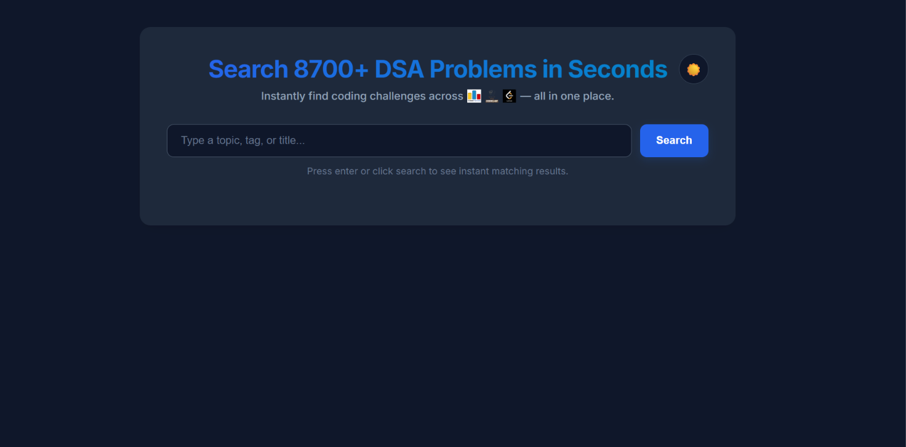
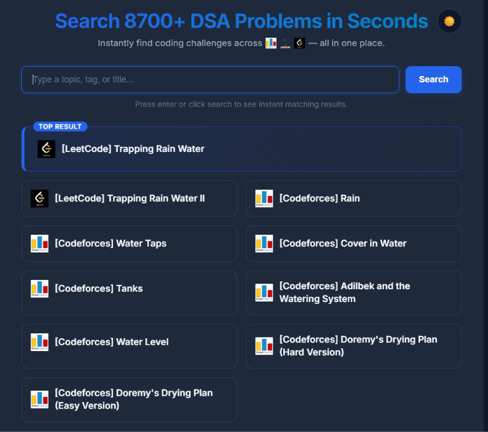
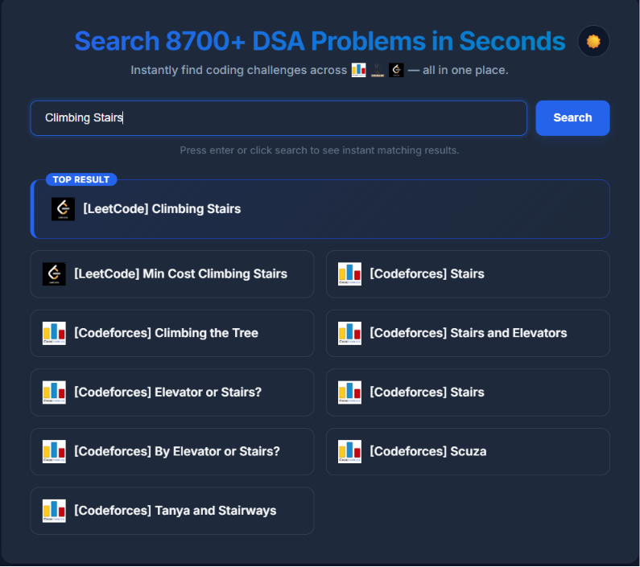

# 🔎 DSA Search Engine

A full-stack search engine for discovering relevant **Data Structures & Algorithms problems** from **LeetCode** and **Codeforces** using **TF-IDF** and **Cosine Similarity** based information retrieval.

🌐 **Live Demo:** https://dsa-search-engine-wdab.onrender.com

---

## Overview

Finding the right coding problem often requires searching across multiple platforms. This project unifies **8,700+ programming problems** into a single searchable corpus and retrieves the most relevant matches using classical Information Retrieval techniques.

The dataset is scraped from **LeetCode** and **Codeforces** using **Puppeteer**, preprocessed, indexed offline, and served through a lightweight **Node.js/Express.js** backend for fast query responses.

---

## Features

- 🔍 Search across **8,700+ DSA problems**
- ⚡ TF-IDF + Cosine Similarity based ranking
- 🎯 Title-aware relevance boosting
- 🕸️ Custom Puppeteer-based scraping pipeline
- 🧹 Text preprocessing and stop-word removal
- 📚 Unified corpus from LeetCode and Codeforces
- 🌙 Dark / Light theme support
- 📱 Responsive user interface
- ☁️ Deployed on Render

---

## Tech Stack

### Frontend
- HTML5
- CSS3
- JavaScript

### Backend
- Node.js
- Express.js

### Information Retrieval
- TF-IDF
- Cosine Similarity
- Natural.js

### Web Scraping
- Puppeteer

### Deployment
- Render

---

## Screenshots

### Homepage



---

### Search Example – Trapping Rain Water



---

### Search Example – Climbing Stairs



---

## Project Structure

```text
.
├── assets/
│   ├── logos/
│   └── screenshots/
├── corpus/
│   ├── all_problems.json
│   ├── problems.json
│   └── search_index.json
├── problems/
├── utils/
│   ├── preprocess.js
│   ├── merge.js
│   └── build-index.js
├── scrape.js
├── index.js
├── index.html
├── styles.css
├── script.js
├── package.json
└── README.md
```

---

## How It Works

1. Scrape problems from **LeetCode** and **Codeforces** using Puppeteer.
2. Merge both datasets into a unified corpus.
3. Preprocess titles and descriptions by:
   - Lowercasing text
   - Removing punctuation
   - Removing stop words
4. Build the TF-IDF index offline and store precomputed document vectors.
5. Convert user queries into TF-IDF vectors.
6. Compute cosine similarity against indexed documents.
7. Apply title-aware score boosting.
8. Return the **Top 10** most relevant problems.

---

## Installation

Clone the repository

```bash
git clone https://github.com/sujeeth-kumar/dsa-search-engine.git
```

Move into the project

```bash
cd dsa-search-engine
```

Install dependencies

```bash
npm install
```

(Optional) Rebuild the search index after updating the dataset

```bash
node utils/build-index.js
```

Start the server

```bash
npm start
```

Open

```
http://localhost:3000
```

---

## Example Queries

- binary search
- climbing stairs
- trapping rain water
- segment tree
- graph bfs
- dijkstra
- union find
- knapsack
- dynamic programming
- prefix sum

---

## Future Improvements

- Platform filters
- Difficulty filters
- Topic-wise filtering
- Autocomplete suggestions
- Fuzzy search
- BM25 ranking
- Semantic search using embeddings

---

## Author

**Sujeeth Kumar Chunarkar**

GitHub: https://github.com/sujeeth-kumar

---

## License

This project is licensed under the ISC License.
